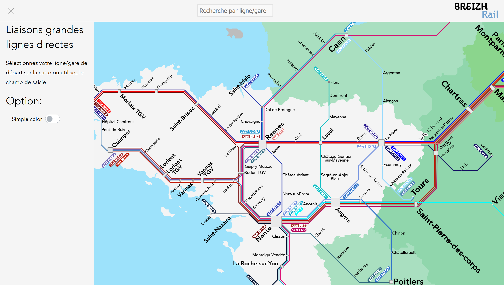

# Octoliner Mapdiver

Octoliner Mapdiver is an open-source software that enables easy visualization of public transport networks. It provides an intuitive interface for users to explore the network map and retrieve relevant information about lines and stations displayed.



## Table of Contents
- [Octoliner Mapdiver](#octoliner-mapdiver)
	- [Table of Contents](#table-of-contents)
	- [Features](#features)
	- [Installation \& Compilation](#installation--compilation)
		- [Dependencies](#dependencies)
		- [Server Compilation](#server-compilation)
		- [Resources Configuration](#resources-configuration)
		- [Customizing Resources](#customizing-resources)
	- [Documentation](#documentation)
		- [Content](#content)
		- [Generation](#generation)
	- [Testing \& Quality Assurance](#testing--quality-assurance)
	- [Contributing, Reporting Issues \& Suggestions](#contributing-reporting-issues--suggestions)
	- [Future Enhancements](#future-enhancements)

## Features
- **Interactive Network Map** – Navigate and zoom across the public transport map effortlessly.
- **Line Information** – Retrieve details about different transport lines.
- **Station Information** – Access data on specific stations, including connections and schedules.

## Installation & Compilation

### Dependencies
This project relies on several external libraries:

- **Sphinx** – Documentation generation
- **Graphviz** – Visualization support
- **anime.js** – JavaScript animation
- **Fabric.js** – Canvas and SVG handling
- **normalizeWheel** – Smooth scrolling experience
- **RxJS** – Reactive event handling
- **OATPP** – server side c++ for fast server response
- **cxxopts** - for argument parsing in c++

### Server Compilation
To compile the server-side application:
```sh
git clone https://github.com/leocity207/WebsiteR2R.git
cd octoliner-maptiva
git submodule init
git submodule update
mkdir build
cd build
cmake ..
cmake --build .
cpack -G TGZ
```
This process generates a local executable that can be run. it will automaticaly be bound to the ressource folder in order to serve resources

### Resources Configuration
- Paths to resources are currently hardcoded and always point toward the `ressource` using cmake config file.
- Future updates may include dynamic configuration support for server.
- Customization of resources is explained inside the documentation.

### Customizing Resources
Octoliner Mapdiver is designed for easy customization. 
- All personalized elements are stored inside `resources/resources-config`.
- Refer to the documentation for details on modifying the experience to suit your needs.

## Documentation
Documentation is available in the `resources/doc/` directory.

### Content
The documentation includes:
- Technical details about resources
- Web server implementation details (C++ backend)
- Resource customization
- Contribution guidelines

### Generation
To build the documenation a few Prerequisites are needed:
- python (latest version is recommended).
- sphinx (for documentatio generation).
- graphviz (to generate diagram).
- rtd_theme installed via

To build the documentation you can run:
```sh
cd resources/doc/
./make.bat html
```

Everything will be outputted inside the `build/html` folder.

## Testing & Quality Assurance
- Currently, testing is performed manually using XML-based validation.
- Future updates will provide more structured quality assurance processes.

## Contributing, Reporting Issues & Suggestions
We welcome contributions!

Refer to the `documentation` file for more details.

reporting bugs can be done this way:
- Report bugs and feature requests via the **GitHub Issues** section.
- Please be clear and provide sufficient details.
- Use Markdown formatting for clarity.

## Future Enhancements
- Dynamic resource path configuration
- Automated testing suite integration
- Better testing 
- Improved UI for better user interaction
- More data to display
- Better configuration

A roadmap is planned. In the meantime, upcoming features are tracked via GitHub Issues

---
We appreciate your interest in Octoliner Mapdiver!
